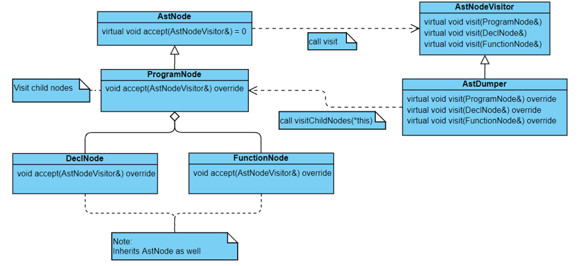

# Hints for visitor pattern

## Class diagram


## Quick mapping
**left hand side: classes in this assignment**  
**right hand side: classes in visitor pattern tutorial**

AstNodeVisitor -> StoreVisitorBase  
AstDumper -> Child/AdultVisitor  
AstNode -> Store  
ProgramNode -> BookStore  

## Complete your first test using visitor pattern
This section demonstrates how to complete your first test: `1_program.p` step by step.  
**(Please read the tutorial for visitor pattern first)**

### Step 1. Modify `AstNode` class.  
#### ast.hpp    
Add the following member functions.  
```cpp
virtual void accept(AstNodeVisitor &p_visitor) = 0;
virtual void visitChildNodes(AstNodeVisitor &p_visitor){};
```
### Step 2. Modify `ProgramNode` class.  
#### program.hpp  
Include the following headers.  
```cpp
#include "AST/CompoundStatement.hpp"
#include "visitor/AstNodeVisitor.hpp"
#include <memory>
```
Add the following attribute.  
```cpp
CompoundStatementNode *m_body;
```
Add the following member functions.  
```cpp
const char *getNameCString() const { return name.c_str(); }
void accept(AstNodeVisitor &p_visitor) override { p_visitor.visit(*this); }
void visitChildNodes(AstNodeVisitor &p_visitor) override;
```
Modify the constructor declaration.  
```cpp
ProgramNode(const uint32_t line, const uint32_t col,
            const char *const p_name, CompoundStatementNode *const p_body
            /* TODO: return type, declarations, functions,
             *       compound statement */);
```
#### program.cpp  
Add the following member function.  
```cpp
void ProgramNode::visitChildNodes(AstNodeVisitor &p_visitor) {
     m_body->accept(p_visitor);
}
```
Modify the constructor definition.  
```cpp
ProgramNode::ProgramNode(const uint32_t line, const uint32_t col,
                         const char *const p_name, CompoundStatementNode *const p_body)
    : AstNode{line, col}, name(p_name), m_body(p_body) {}
```

### Step 3. Modify `CompoundStatementNode` class.  
#### CompoundStatementNode.hpp  
Include the following header.  
```cpp
#include "visitor/AstNodeVisitor.hpp"
```
Add the following member functions.  
```cpp
void accept(AstNodeVisitor &p_visitor) override { p_visitor.visit(*this); }
void visitChildNodes(AstNodeVisitor &p_visitor) override;
```
#### CompoundStatementNode.cpp  
Add the following member function.  
```cpp
void CompoundStatementNode::visitChildNodes(AstNodeVisitor &p_visitor) {
    // TODO
}
```
### Step 4. Modify `AstDumper.cpp` file.  
Remove the following code.  
```cpp
#ifdef I_WANT_TO_USE_VISITOR_PATTERN
#endif
```
### Step 5. Modify `parser.y` file.  
Include the following header.  
```
#include "AST/AstDumper.hpp"
```
Add the following statement in the `%code requires` clause.  
```
class CompoundStatementNode;
```
Add the following statement in the `%union` clause.  
```
CompoundStatementNode *compound_stmt_ptr;
```
Add the following type.  
```
%type <compound_stmt_ptr> CompoundStatement
```
Change the reduction rule of `Program`.  
```
Program:
    ProgramName SEMICOLON
    /* ProgramBody */
    DeclarationList FunctionList CompoundStatement
    /* End of ProgramBody */
    END {
        root = new ProgramNode(@1.first_line, @1.first_column,
                               $1, $5);

        free($1);
    }
;
```
Change the reduction rule of `CompoundStatement`.  
```
CompoundStatement:
    BEGIN_
    DeclarationList
    StatementList
    END {
        $$ = new CompoundStatementNode(@1.first_line, @1.first_column);
    }
;
```
Change the if statement in main function.  
```
if (argc >= 3 && strcmp(argv[2], "--dump-ast") == 0) {
        AstDumper ast_dumper;
        root->accept(ast_dumper);
    }
```
### Step 6. Use Makefile-vp.  
Change the name of src/Makefile-vp to src/Makefile.  

### Step 7. Run the test.  
Use `make test` to run your program, you should pass `1_program.p` and get 5 points!  
You can check the output in test/result /1_program:  
```
program <line: 4, col: 1> program void
  compound statement <line: 8, col: 1>

|--------------------------------|
|  There is no syntactic error!  |
|--------------------------------|
```

### Note
Please make sure you understand the meaning of the code in each step, otherwise, you will probably have a hard time debugging and find yourself lost in the large code base.

We use the same design in HW4 and HW5, fully understand the way we manipulate AST will save you **a lot of** time during the final exam week.  (・ω・)ノ
